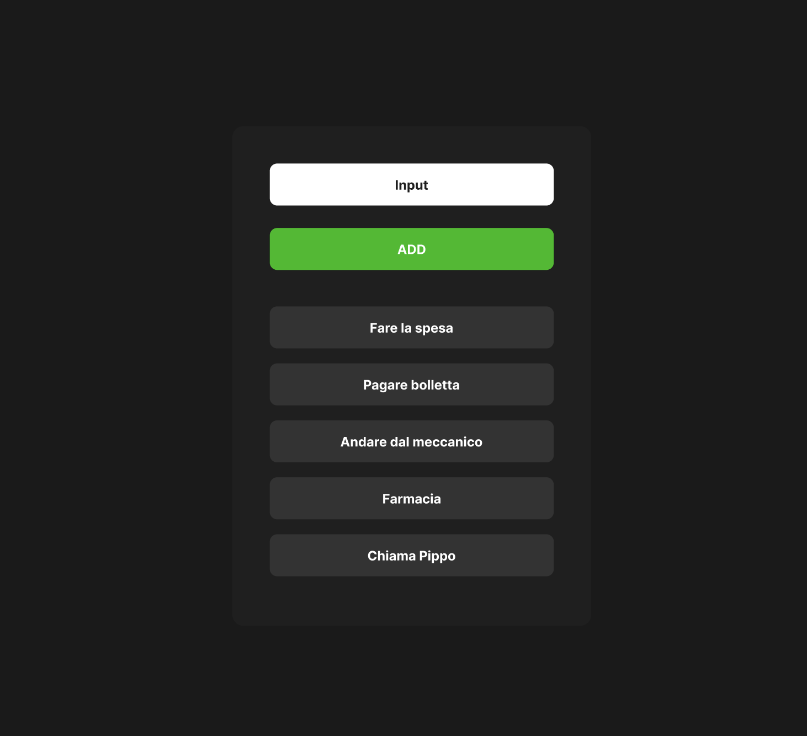

# Frontend Mentor - Social links profile

Realizzare una todolist come quella che vi lascio in in allegato nell'immagine; nell'input dovete scrivere il titolo della singola todo che al click del bottone dovrà essere aggiunta alla lista di todos.

## Panoramica

### La sfida

Esercizio facoltativo uno:
aggiungere un bottone alle todos che al click, cancella la specifica todo dalla lista.

Esercizio facoltativo due:
inserire input di tipo testuale e di tipo submit all'interno di una form e fare in modo che funzioni tutto perfettamente. 

### Screenshot dell'esempio da seguire

#Struttura Progetto

my-todo-app/
├── src/
│   ├── index.css
│   ├── app.module.css
│   ├── app.jsx
│   ├── main.jsx
├── package.json
├── package-lock.json
├── .gitignore
└── README.md

## Il mio processo

### Struttura del Progetto

HTML:
Costruisci la struttura HTML seguendo il layout del design. Assicurati di includere tutti gli elementi richiesti come le icone dei social media, i testi, ecc.

CSS:
Utilizza i dettagli della guida di stile per applicare i colori, i font e altri stili. Definisci gli stati di hover e focus per gli elementi interattivi.

Autore

Stefania Beninati 
