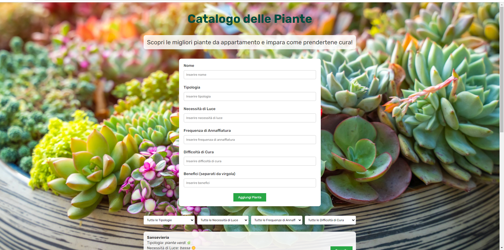

# My Plant Catalog

 

## 🚀 Panoramica del Progetto

**My Plant Catalog** è un'applicazione progettata per realizzare un catalogo di piante, offrendo la possibilità di aggiungere, visualizzare e filtrare gli elementi del catalogo. Gli utenti possono inserire nuovi elementi tramite un modulo e visualizzarli a video. È possibile anche eliminare gli elementi dal catalogo. Inoltre, è implementata una funzionalità di filtro per visualizzare solo le piante che soddisfano determinati criteri, ad esempio per tipo di pianta.

La sfida principale era realizzare un catalogo con massima libertà espressiva, incorporando funzionalità di aggiunta, visualizzazione, eliminazione e filtraggio degli elementi.

## 🛠️ Tecnologie Utilizzate

- **React**: Utilizzato per costruire l'interfaccia utente e gestire lo stato dell'applicazione.
- **CSS**: Per la stilizzazione e il layout, applicando dettagli come colori, font e stati di hover.
- **HTML**: Costruzione della struttura di base per il catalogo.
- **JavaScript**: (Se applicabile) Gestione della logica e delle interazioni dell'applicazione.

### La sfida

Realizzare un catalogo di qualunque cosa desideriate, con massima libertà espressiva. Nel catalogo dovremo poter aggiungere elementi tramite una form e mostrarli a video, con la possibilità di cancellarli, proprio come abbiamo fatto ieri. Questa volta, però, avremo bisogno di uno stato per filtrare gli elementi del catalogo. Scegliete voi come filtrare i dati. Ad esempio, in un catalogo di Pokémon, potremmo filtrare per mostrare tutti i Pokémon di tipo acqua.

## 📂 Struttura del Progetto

my-plant-catalog/
├── src/
│   ├── components/
│   │   └── Piante.jsx
│   ├── index.css
│   ├── app.module.css
│   ├── app.jsx
│   ├── main.jsx
├── package.json
├── package-lock.json
├── .gitignore
└── README.md

Il repository è organizzato come segue:
## 🎨 Funzionalità Principali

- **Aggiunta di Elementi**: Permette agli utenti di aggiungere nuove piante al catalogo tramite un modulo.
- **Visualizzazione**: Mostra tutti gli elementi del catalogo con le informazioni pertinenti.
- **Eliminazione**: Gli utenti possono rimuovere piante dal catalogo.
- **Filtraggio**: Filtra le piante in base a criteri selezionati, come il tipo di pianta.

## 🚀 Come Iniziare

Per ottenere una copia locale del progetto e avviarlo, segui questi passaggi:

1. **Clona il repository**:
   ```bash
   git clone https://github.com/aniaBeninati/esercitazioni-Ema.git