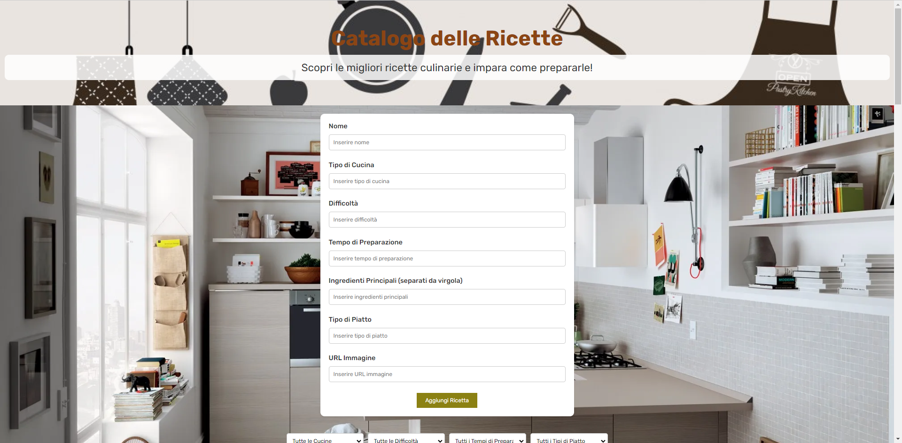

# My Recipe App



## 🚀 Panoramica del Progetto

**My Recipe App** è un'applicazione che consente di creare e gestire un catalogo di ricette. Gli utenti possono aggiungere nuove ricette tramite un modulo, visualizzarle, e rimuoverle dal catalogo. Inoltre, è presente una funzionalità di filtraggio per visualizzare solo le ricette che soddisfano determinati criteri. Ad esempio, potresti filtrare le ricette per tipo di cucina, difficoltà o tempo di preparazione.

### La sfida

Realizzare un catalogo con massima libertà espressiva, includendo la possibilità di aggiungere, visualizzare e cancellare elementi. Inoltre, il progetto richiede la creazione di un componente layout e l'utilizzo dei children per passare dati ai componenti.

## 🛠️ Tecnologie Utilizzate

- **React**: Per costruire l'interfaccia utente e gestire lo stato dell'applicazione.
- **CSS Modules**: Per la stilizzazione dei componenti in modo modulare.
- **HTML**: Struttura di base delle pagine web.


### La sfida

Realizzare un catalogo di qualunque cosa desideriate, con massima libertà espressiva. Nel catalogo dovremo poter aggiungere elementi tramite una form e mostrarli a video, con la possibilità di cancellarli, proprio come abbiamo fatto ieri. Questa volta, però, avremo bisogno di uno stato per filtrare gli elementi del catalogo. Scegliete voi come filtrare i dati. Ad esempio, in un catalogo di Pokémon, potremmo filtrare per mostrare tutti i Pokémon di tipo acqua.
Create un componente layout e usate il children per passarci dati

## 📂 Struttura del Progetto

Il repository è organizzato come segue:

my-recipe-app/
├── src/
│   ├── components/
│   │   ├── Header/
│   │   │   ├── Header.jsx
│   │   │   └── Header.module.css
│   │   ├── Footer/
│   │   │   ├── Footer.jsx
│   │   │   └── Footer.module.css
│   │   ├── Food/
│   │   │   ├── Food.jsx
│   │   │   └── Food.module.css
│   │   ├── Layout/
│   │   │   ├── Layout.jsx
│   │   │   └── Layout.module.css
│   ├── App.jsx
│   ├── App.module.css
│   ├── index.css
│   └── index.jsx
├── public/
│   └── index.html
├── package.json
├── package-lock.json
├── .gitignore
└── README.md


## Il mio processo

### Struttura del Progetto

HTML:
Costruisci la struttura HTML seguendo il layout del design. Assicurati di includere tutti gli elementi richiesti come le icone dei social media, i testi, ecc.

CSS:
Utilizza i dettagli della guida di stile per applicare i colori, i font e altri stili. Definisci gli stati di hover e focus per gli elementi interattivi.


## 🎨 Funzionalità Principali

- **Aggiunta di Ricette**: Gli utenti possono aggiungere nuove ricette al catalogo tramite un modulo.
- **Visualizzazione**: Mostra tutte le ricette aggiunte con dettagli pertinenti.
- **Eliminazione**: Gli utenti possono rimuovere ricette dal catalogo.
- **Filtraggio**: Permette di filtrare le ricette in base a criteri come tipo di cucina, difficoltà o tempo di preparazione.
- **Componente Layout**: Un componente layout è utilizzato per gestire la struttura generale dell'app, con dati passati tramite children.

## 🚀 Come Iniziare

Per ottenere una copia locale del progetto e avviarlo, segui questi passaggi:

1. **Clona il repository**:
   ```bash
   git clone https://github.com/aniaBeninati/esercitazioni-Ema.git

