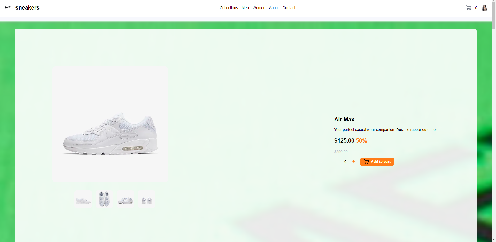

# E-Commerce Product Page

 

## 🚀 Panoramica del Progetto

**E-Commerce Product Page** è una pagina di prodotto per un sito di e-commerce che offre un'esperienza utente interattiva e visivamente accattivante. La pagina consente agli utenti di:

- Aprire una galleria lightbox cliccando sulla grande immagine del prodotto.
- Cambiare la grande immagine del prodotto cliccando sulle piccole immagini in miniatura.
- Aggiungere articoli al carrello e visualizzare il carrello.
- Rimuovere articoli dal carrello.
- Visualizzare il layout ottimale a seconda delle dimensioni dello schermo del loro dispositivo.
- Vedere gli stati hover per tutti gli elementi interattivi della pagina.

### La sfida

La tua sfida è costruire una pagina prodotto di e-commerce il più simile possibile al design fornito. Utilizza qualsiasi strumento e tecnica che ritieni utile per completare la sfida. L'obiettivo è creare componenti modulari e indipendenti, evitando di passare direttamente funzioni ai componenti stessi. Testa e modifica il codice per ottimizzare i tuoi componenti e l'interfaccia utente.

## 🛠️ Tecnologie Utilizzate

- **React**: Per costruire l'interfaccia utente e gestire lo stato dell'applicazione.
- **CSS Modules**: Per la stilizzazione dei componenti in modo modulare e scalabile.
- **HTML**: Struttura di base delle pagine web.

### La sfida

La tua sfida è costruire questa pagina prodotto di e-commerce e farla sembrare il più possibile simile al design.

Puoi utilizzare qualsiasi strumento tu voglia per aiutarti a completare la sfida. Quindi, se hai qualcosa su cui vuoi esercitarti, sentiti libero di provarlo.

I tuoi utenti dovrebbero essere in grado di:

Aprire una galleria lightbox cliccando sulla grande immagine del prodotto
Cambiare la grande immagine del prodotto cliccando sulle piccole immagini in miniatura
Aggiungere articoli al carrello
Visualizzare il carrello e rimuovere articoli da esso
Visualizzare il layout ottimale del sito a seconda delle dimensioni dello schermo del loro dispositivo
Vedere gli stati hover per tutti gli elementi interattivi della pagina

Nel farlo, seguite ciò che abbiamo fatto in classe, provate a fare dei cambiamenti, a testare il codice e creare componenti che prendono funzioni e poi provate vedere come è possibile non dover passare direttamente una funzione al componente stesso.
Il nostro obiettivo è rendere i nostri componenti il più possibile liberi e indipendenti!
Metteteci del vostro estro!

## 📂 Struttura del Progetto

Il repository è organizzato come segue:

src
|-- assets
|   |-- fonts
|   |   |-- KumbhSans-Bold.ttf
|   |   `-- KumbhSans-Regular.ttf
|   `-- images
|       |-- air_max
|       |   |-- main.jpg
|       |   |-- thumb1.jpg
|       |   |-- thumb2.jpg
|       |   |-- thumb3.jpg
|       |   `-- thumb4.jpg
|       |-- air_force
|       |   |-- main.jpg
|       |   |-- thumb1.jpg
|       |   |-- thumb2.jpg
|       |   |-- thumb3.jpg
|       |   `-- thumb4.jpg
|       |-- dunk
|       |   |-- main.jpg
|       |   |-- thumb1.jpg
|       |   |-- thumb2.jpg
|       |   |-- thumb3.jpg
|       |   `-- thumb4.jpg
|       |-- y2k
|       |   |-- main.jpg
|       |   |-- thumb1.jpg
|       |   |-- thumb2.jpg
|       |   |-- thumb3.jpg
|       |   `-- thumb4.jpg
|       |-- air_jordan
|       |   |-- main.jpg
|       |   |-- thumb1.jpg
|       |   |-- thumb2.jpg
|       |   |-- thumb3.jpg
|       |   `-- thumb4.jpg
|       |-- pegasus
|       |   |-- main.jpg
|       |   |-- thumb1.jpg
|       |   |-- thumb2.jpg
|       |   |-- thumb3.jpg
|       |   `-- thumb4.jpg
|       |-- metcon
|       |   |-- main.jpg
|       |   |-- thumb1.jpg
|       |   |-- thumb2.jpg
|       |   |-- thumb3.jpg
|       |   `-- thumb4.jpg
|       |-- mercurial
|           |-- main.jpg
|           |-- thumb1.jpg
|           |-- thumb2.jpg
|           |-- thumb3.jpg
|           `-- thumb4.jpg
|-- components
|   |-- button
|   |   |-- Button.jsx
|   |   `-- Button.module.css
|   |-- counter
|   |   |-- Counter.jsx
|   |   `-- Counter.module.css
|   |-- icons
|   |   |-- IconCart.jsx
|   |   |-- IconMinus.jsx
|   |   `-- IconPlus.jsx
|   |-- product-lightbox
|   |   |-- ProductLightBox.jsx
|   |   `-- ProductLightBox.module.css
|   |-- showbox
|   |   |-- ShowBox.jsx
|   |   `-- ShowBox.module.css
|   `-- thumbnail
|       |-- ThumbNail.jsx
|       `-- ThumbNail.module.css
|-- styles
|   `-- App.module.css
|-- App.jsx
|-- index.jsx
`-- index.module.css


## Il mio processo

### Struttura del Progetto

HTML:
Costruisci la struttura HTML seguendo il layout del design. Assicurati di includere tutti gli elementi richiesti come le icone dei social media, i testi, ecc.

CSS:
Utilizza i dettagli della guida di stile per applicare i colori, i font e altri stili. Definisci gli stati di hover e focus per gli elementi interattivi.


## 🎨 Funzionalità Principali

- **Galleria Lightbox**: Apri una galleria lightbox cliccando sulla grande immagine del prodotto.
- **Cambio Immagine**: Cambia la grande immagine del prodotto cliccando sulle piccole immagini in miniatura.
- **Carrello**: Aggiungi articoli al carrello, visualizza il carrello e rimuovi articoli da esso.
- **Layout Responsivo**: Visualizza il layout ottimale su diversi dispositivi, assicurando una buona esperienza utente su schermi di varie dimensioni.
- **Stati Hover**: Definisci stati hover per tutti gli elementi interattivi della pagina.

## 🚀 Come Iniziare

Per ottenere una copia locale del progetto e avviarlo, segui questi passaggi:

1. **Clona il repository**:
   ```bash
   git clone https://github.com/aniaBeninati/esercitazioni-Ema.git

