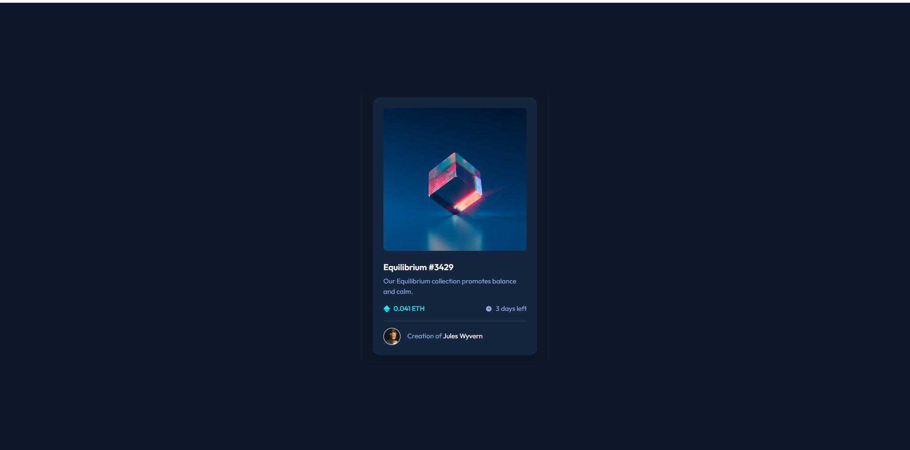

# E-Commerce Product Page



## 🚀 Panoramica del Progetto

**E-Commerce Product Page** è una pagina di prodotto per un sito di e-commerce progettata per offrire un'esperienza utente interattiva e visivamente accattivante. La pagina permette agli utenti di:

- Visualizzare una galleria lightbox cliccando sulla grande immagine del prodotto.
- Cambiare la grande immagine del prodotto cliccando sulle piccole immagini in miniatura.
- Aggiungere articoli al carrello e visualizzare il carrello.
- Rimuovere articoli dal carrello.
- Visualizzare il layout ottimale in base alle dimensioni dello schermo del loro dispositivo.
- Vedere gli stati hover per tutti gli elementi interattivi della pagina.

### La sfida

La tua sfida consiste nel costruire un componente della scheda di anteprima per un prodotto e farlo apparire il più vicino possibile al design fornito. Puoi utilizzare qualsiasi strumento e tecnica che ritieni utile per completare la sfida. L'obiettivo è creare componenti modulari e indipendenti, evitando di passare direttamente funzioni ai componenti stessi. Testa e modifica il codice per ottimizzare i tuoi componenti e migliorare l'interfaccia utente.

## 🛠️ Tecnologie Utilizzate

- **React**: Per costruire l'interfaccia utente e gestire lo stato dell'applicazione.
- **CSS Modules**: Per la stilizzazione dei componenti in modo modulare e scalabile.
- **HTML**: Struttura di base delle pagine web.

### La sfida

La tua sfida consiste nel costruire questo componente della scheda di anteprima e farlo apparire il più vicino possibile al design.

Puoi utilizzare qualsiasi strumento desideri per aiutarti a completare la sfida. Quindi, se hai qualcosa che ti piacerebbe praticare, sentiti libero di provarlo.

I tuoi utenti dovrebbero essere in grado di:

Visualizzare il layout ottimale in base alle dimensioni dello schermo del loro dispositivo
Vedere gli stati di hover per gli elementi interattivi
Scaricare il progetto e leggere il file README.md. Questo fornirà ulteriori dettagli sul progetto e ti aiuterà a configurarlo.

## 📂 Struttura del Progetto

Il repository è organizzato come segue:
e-commerce-product-page/ ├── src/ │ ├── assets/ │ │ ├── fonts/ │ │ │ ├── KumbhSans-Bold.ttf │ │ │ └── KumbhSans-Regular.ttf │ │ └── images/ │ │ ├── air_max/ │ │ │ ├── main.jpg │ │ │ ├── thumb1.jpg │ │ │ ├── thumb2.jpg │ │ │ ├── thumb3.jpg │ │ │ └── thumb4.jpg │ │ ├── air_force/ │ │ │ ├── main.jpg │ │ │ ├── thumb1.jpg │ │ │ ├── thumb2.jpg │ │ │ ├── thumb3.jpg │ │ │ └── thumb4.jpg │ │ ├── dunk/ │ │ │ ├── main.jpg │ │ │ ├── thumb1.jpg │ │ │ ├── thumb2.jpg │ │ │ ├── thumb3.jpg │ │ │ └── thumb4.jpg │ │ ├── y2k/ │ │ │ ├── main.jpg │ │ │ ├── thumb1.jpg │ │ │ ├── thumb2.jpg │ │ │ ├── thumb3.jpg │ │ │ └── thumb4.jpg │ │ ├── air_jordan/ │ │ │ ├── main.jpg │ │ │ ├── thumb1.jpg │ │ │ ├── thumb2.jpg │ │ │ ├── thumb3.jpg │ │ │ └── thumb4.jpg │ │ ├── pegasus/ │ │ │ ├── main.jpg │ │ │ ├── thumb1.jpg │ │ │ ├── thumb2.jpg │ │ │ ├── thumb3.jpg │ │ │ └── thumb4.jpg │ │ ├── metcon/ │ │ │ ├── main.jpg │ │ │ ├── thumb1.jpg │ │ │ ├── thumb2.jpg │ │ │ ├── thumb3.jpg │ │ │ └── thumb4.jpg │ │ └── mercurial/ │ │ ├── main.jpg │ │ ├── thumb1.jpg │ │ ├── thumb2.jpg │ │ ├── thumb3.jpg │ │ └── thumb4.jpg │ ├── components/ │ │ ├── button/ │ │ │ ├── Button.jsx │ │ │ └── Button.module.css │ │ ├── counter/ │ │ │ ├── Counter.jsx │ │ │ └── Counter.module.css │ │ ├── icons/ │ │ │ ├── IconCart.jsx │ │ │ ├── IconMinus.jsx │ │ │ └── IconPlus.jsx │ │ ├── product-lightbox/ │ │ │ ├── ProductLightBox.jsx │ │ │ └── ProductLightBox.module.css │ │ ├── showbox/ │ │ │ ├── ShowBox.jsx │ │ │ └── ShowBox.module.css │ │ └── thumbnail/ │ │ ├── ThumbNail.jsx │ │ └── ThumbNail.module.css │ ├── styles/ │ │ └── App.module.css │ ├── App.jsx │ ├── index.jsx │ └── index.module.css ├── public/ │ └── index.html ├── package.json ├── package-lock.json ├── .gitignore └── README.md


## Il mio processo

### Struttura del Progetto

HTML:
Costruisci la struttura HTML seguendo il layout del design. Assicurati di includere tutti gli elementi richiesti come le icone dei social media, i testi, ecc.

CSS:
Utilizza i dettagli della guida di stile per applicare i colori, i font e altri stili. Definisci gli stati di hover e focus per gli elementi interattivi.


## 🎨 Funzionalità Principali

- **Galleria Lightbox**: Apri una galleria lightbox cliccando sulla grande immagine del prodotto.
- **Cambio Immagine**: Cambia la grande immagine del prodotto cliccando sulle piccole immagini in miniatura.
- **Carrello**: Aggiungi articoli al carrello, visualizza il carrello e rimuovi articoli da esso.
- **Layout Responsivo**: Visualizza il layout ottimale su diversi dispositivi, assicurando una buona esperienza utente su schermi di varie dimensioni.
- **Stati Hover**: Definisci stati hover per tutti gli elementi interattivi della pagina.

## 🚀 Come Iniziare

Per ottenere una copia locale del progetto e avviarlo, segui questi passaggi:

1. **Clona il repository**:
   ```bash
   git clone https://github.com/aniaBeninati/esercitazioni-Ema.git

