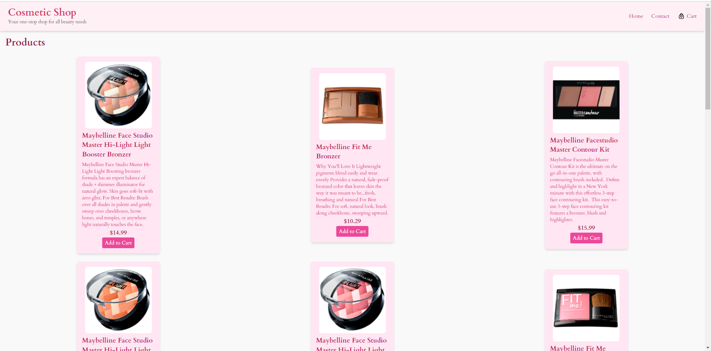

# My E-Commerce



## 🚀 Panoramica del Progetto

**My E-Commerce** è una semplice applicazione e-commerce che include una pagina home per visualizzare i prodotti e una pagina carrello per gestire gli articoli aggiunti. Il progetto dimostra come scaricare dati da un server, salvarli nel `localStorage`, e gestire la navigazione tra le pagine. 

### La sfida

L'esercizio richiede una serie di operazioni chiave:
- Scaricare dati da un server al primo render della pagina home.
- Salvare i dati nel `localStorage`.
- Navigare tra la pagina home e la pagina carrello.
- Prelevare i dati salvati nel `localStorage` e mostrarli nella pagina carrello.
- Modificare i dati del carrello, inclusi aggiungere e rimuovere articoli.

## 🛠️ Tecnologie Utilizzate

- **React**: Per costruire l'interfaccia utente e gestire lo stato dell'applicazione.
- **React Router**: Per gestire la navigazione tra le pagine.
- **Tailwind CSS**: Per la stilizzazione dell'applicazione.
- **CSS**: Per personalizzazioni specifiche.

## 📂 Struttura del Progetto

Il repository è organizzato come segue:

my-ecommerce/
├── node_modules/
├── public/
│   ├── index.html
├── src/
│   ├── assets/
│   │   └── cart-heart-svgrepo-com.svg
│   ├── components/
│   │   ├── NavBar.jsx
│   │   ├── DefaultLayout.jsx
│   │   └── Footer.jsx
│   ├── pages/
│   │   ├── Cart.jsx
│   │   ├── Contact.jsx
│   │   └── ErrorPage.jsx
│   ├── App.jsx
│   ├── index.css
│   └── main.jsx
├── package.json
├── tailwind.config.js
└── README.md


src/components/: per i componenti condivisi
src/pages/: per le pagine
src/index.css: per lo stile personalizzato (incluso Tailwind)

Il mio processo
Ho seguito un processo chiaro e organizzato per creare un'applicazione e-commerce utilizzando React, React Router e Tailwind CSS. Ho creato componenti riutilizzabili, configurato le rotte in modo efficiente e stilizzato l'applicazione con Tailwind CSS. Ho creato una pagina App.jsx (Home) che mostra i prodotti e una pagina Cart che mostra i prodotti aggiunti al carrello. Si possono aggiungere e rimuovere prodotti dal carrello e navigare tra le pagine "Home" e Cart.


- **`src/components/`**: Contiene i componenti condivisi dell'applicazione come la barra di navigazione, il layout predefinito e il piè di pagina.
- **`src/pages/`**: Contiene le pagine dell'applicazione, inclusi la home, il carrello e la pagina di contatto.
- **`src/index.css`**: Per lo stile personalizzato, inclusi i dettagli di Tailwind CSS.
- **`tailwind.config.js`**: Configurazione di Tailwind CSS.

## 🎨 Funzionalità Principali

- **Pagina Home**: Visualizza i prodotti scaricati da un server. Permette di aggiungere prodotti al carrello.
- **Pagina Carrello**: Mostra i prodotti aggiunti al carrello, con possibilità di rimuovere articoli e aggiornare la visualizzazione.
- **Persistenza dei Dati**: Utilizza `localStorage` per memorizzare e recuperare i dati del carrello tra le pagine.
- **Navigazione**: Utilizza React Router per navigare tra la pagina home e la pagina carrello.

## 🚀 Come Iniziare

Per ottenere una copia locale del progetto e avviarlo, segui questi passaggi:

1. **Clona il repository**:
   ```bash
   git clone https://github.com/aniaBeninati/esercitazioni-Ema.git

