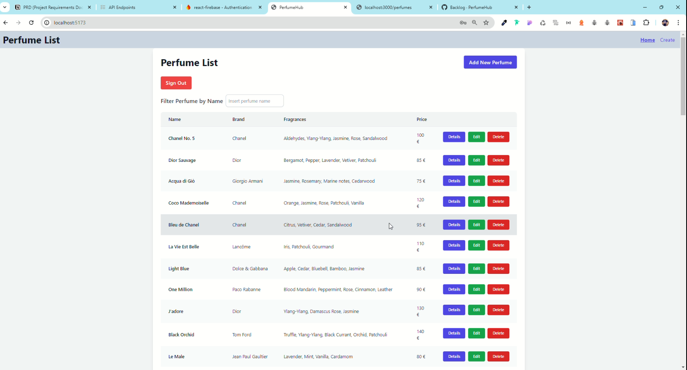

# Project Requirements Document (PRD) - PerfumeHub

## 📋 Scopo e Obiettivo

L'obiettivo del progetto PerfumeHub è sviluppare un'applicazione per gestire il catalogo dei profumi di un negozio online. Il sistema deve permettere ai dipendenti di gestire, aggiornare e visualizzare i profumi.

## 🌟 Panoramica del Prodotto e Casi d'Uso

PerfumeHub è una piattaforma che permette ai dipendenti di:

1. **Cercare** un profumo tra una lista di profumi.
2. **Visualizzare** i dettagli di un profumo specifico.
3. **Filtrare** la lista dei profumi per migliorare la ricerca.

### Requisiti per il Primo Rilascio: MVP

- **Ricerca dei Profumi**: Come dipendente, voglio poter cercare un profumo all’interno del gestionale.
- **Dettagli del Profumo**: Come dipendente, voglio poter vedere il dettaglio di un profumo.
- **Filtraggio della Lista**: Come dipendente, voglio poter filtrare la mia lista di profumi.

### Requisiti per il Secondo Rilascio: Update / Edit / Delete

- **Aggiunta di Profumi**: Come dipendente, voglio poter aggiungere un profumo alla lista di profumi.
- **Aggiornamento di Profumi**: Come dipendente, voglio poter aggiornare un profumo nella lista di profumi.
- **Cancellazione di Profumi**: Come dipendente, voglio poter cancellare un profumo dalla lista di profumi.

### Requisiti per il Terzo Rilascio

- **Lista Preferiti**: Come utente, voglio poter inserire un profumo all’interno di una lista di profumi preferiti.

### Requisiti per il Quarto Rilascio: Toast

- **Feedback delle Operazioni**: Come dipendente, voglio poter sapere se ogni operazione effettuata sul catalogo va a buon fine (con notifiche toast).

### Requisiti per il Quinto Rilascio

- **Area Riservata**: Come dipendente finale, voglio avere un’area riservata dove gestire le mie informazioni.

## 🛠️ Requisiti Tecnici

- **Frontend**: React per costruire l'interfaccia utente.
- **Deploy**: Vercel per il deployment dell'applicazione.
- **Simulazione di Database**: Utilizzo di dati simulati in memoria per la gestione dei profumi.

### Product overview and use cases

- Ogni dipendente di PerfumeHub deve avere la possibilità di gestire il catalogo dei profumi e aggiornarlo al bisogno

### Requirements

Primo rilascio: MVP

- Come Dipendente voglio poter cercare un profumo tra una lista di profumi all’interno d**el mio gestionale**
- Come dipendente voglio poter vedere il dettaglio di un profumo
- Come dipendente voglio poter filtrare la mia lista profumi

Secondo rilascio: Update / Edit / Delete

- Come dipendente voglio poter ***aggiungere*** un profumo alla lista di profumi
- Come dipendente voglio poter ***aggiornare*** un profumo alla lista di profumi
- Come dipendente voglio poter ***cancellare*** un profumo alla lista di profumi

Terzo rilascio: 

- Come utente voglio poter inserire un profumo all’interno di una lista di profumi preferiti

Quarto rilascio: toster

- Come dipendente voglio poter sapere se ogni operazione fatta sul catalogo vada o no a buon fine (toast)

Quinto rilascio: 

- Come dipendente finale voglio avere un’area riservata dove gestire le mie informazioni

### Technical requirements:

- React per FE
- Vercel x deploy

# Simulazione di un database in memoria

perfumes = [
{
                    "id": "1",
                    "name": "Esempio Profumo 1",
                    "brand": "Casa Profumi 1",
                    "description": "Descrizione del profumo 1",
                    "price": 50.0,
                    "fragrances": ["Rosa", "Lavanda"],
                    "genre": "maschile",
                    "imageUrl": "http://example.com/image1.jpg"
                    },
                    {
                    "id": "2",
                    "name": "Esempio Profumo 2",
                    "brand": "Casa Profumi 2",
                    "description": "Descrizione del profumo 2",
                    "price": 70.0,
                    "fragrances": ["Vaniglia", "Gelsomino"],
                    "genre": "femminile",
                    "imageUrl": "http://example.com/image2.jpg"
                    }
]

Questa API include le seguenti funzionalità:

1. **GET /perfumes**: Ottiene la lista di tutti i profumi.
2. **GET /perfumes/<id>**: Ottiene i dettagli di un singolo profumo specificato dall'id.
3. **POST /perfumes**: Aggiunge un nuovo profumo alla lista.
4. **PUT /perfumes/<id>**: Aggiorna i dettagli di un profumo esistente specificato dall'id.
5. **DELETE /perfumes/<id>**: Elimina un profumo esistente specificato dall'id.
6. 

Ogni profumo ha i seguenti campi:

- **id**: string (Identificativo univoco del profumo)
- **name**: string (Titolo del profumo)
- **brand**: string (Marca del profumo)
- **description**: string (Descrizione del profumo)
- **price**: number (Prezzo del profumo)
- **fragrances**: array (Fragranze del profumo)
- **genre**: string (Genere del profumo: maschile, femminile, bambino)
- **imageUrl**: string (Immagine del profumo)

PRD Notion
https://abyssinian-hyssop-39b.notion.site/PRD-Project-Requirements-Document-9237f63cb2b44f2a9eb8de2d2d977f23?pvs=4

API Endponts
https://abyssinian-hyssop-39b.notion.site/7547b3f07b0a4a989b768ba8861e01e5?v=b660236fd88242d0be9265bb450b0cfc&pvs=4
